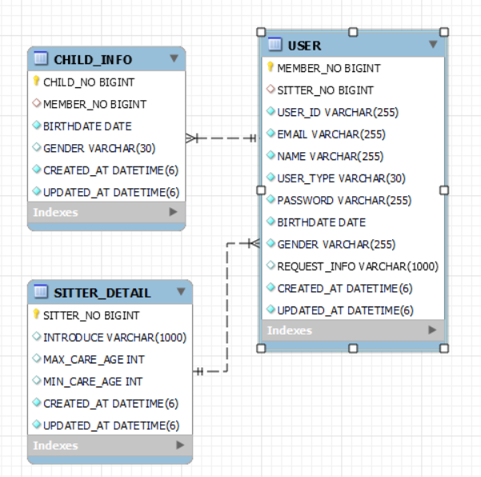

# 1. 환경 구성
## 1. api
- java : open jdk 11
- gradle : 7.2 
- spring boot : 2.5.5
- mysql: 8
- redis: 6
## 2. build
- docker : 20.10.8

# 2. 실행 가이드
## 1. jar 방식
1. mysql db, redis - db 실행
```
$ cd db
$ docker-comopse up -d
```
2. jar 실행
```
$ cd ../
$ java -jar app-0.0.1-SNAPSHOT.jar
```
## 2. docker-compose 방식 (전체)
1. mysql db, redis, app 올리기
```
$ docker-compose up -d
```

2. 포트 정보
```
mysql - port : 3306
redis - port 16379
web - port 8080
```
# 3. spec 문서
[spec문서 다운로드(html, open api, postman)](documents/specs)
[spec문서 (html) ](documents/specs/index.html)
# 4. DB정보

[DDL 다운로드](db/mysql/ddl.sql)


## USER : 유저 정보
| **key** | **설명** |
| --- | --- |
| MEMBER_NO | 유저 넘버(PK) | 
| SITTER_NO | 시터 내용 넘버(FK) |
| USER_ID | 유저ID | 
| EMAIL | 이메일 | 
| NAME | 이름 | 
| USER_TYPE | 유저 타입 | 
| PASSWORD | 비밀번호| 
| BIRTHDATE | 생년월일 |
| GENDER | 성별 | 
| REQUEST_INFO | 신청 내용 |
| CREATED_AT | 생성일 |
| UPDATED_AT | 수정일 |

## SITTER_DETAIL : 시터 상세정보
| **key** | **설명** |
| --- | --- |
| SITTER_NO | 시터 넘버(PK) |
| INTRODUCE | 자기 소개	 | 
| MAX_CARE_AGE | 케어 가능한 최대 연령 |
| MIN_CARE_AGE | 케어 가능한 최소 연령 |
| CREATED_AT | 생성일 | 
| UPDATED_AT | 수정일 | 

## CHILD_INFO : 아이 정보
| **key** | **설명** |
| --- | --- |
| CHILD_NO | 아이 넘버(PK) |
| MEMBER_NO | 유저 넘버(FK) | 
| BIRTHDATE | 생년월일 |
| GENDER | 성별 |
| CREATED_AT | 생성일 | 
| UPDATED_AT | 수정일 | 

# 4. 요청 출처
```
https://github.com/mfort-inc/momsitter-2021-1th-api-assignment
```